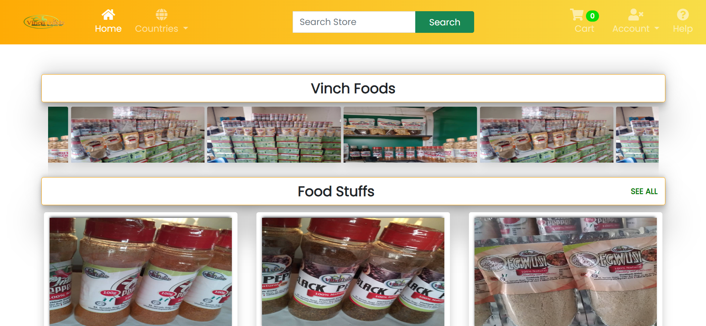

# *VINCH*

A well featured ecommerce website for buying and selling.

# *HOME PAGE VIEW*



## Teechnology Used

1. DJango (Backend)
2. Html, Css, Javascript (Frontend)
3. Json (Sending data from front end to the backend)
4. Database (Django Orm)

## Feature

1. Authentication and Authorization
2. Add to cart (User must be authorized before checking out)
3. Email Notification
4. Check Out (Whatsapp)

# Getting Started

## Installation

1. Clone the repository
    bash 
    ```
        git clone https://github.com/solomonbestz/vinch.git
    ```

2. Create Virtual Environment
    bash
    ```
        py -m venv venv
    ```

3. Activate Virtual Environment
    bash
    ```
        ./venv/Scripts/activate
    ```

4. Install Dependencies
    bash
    ```
        pip install -r requirements.txt
    ```

## Usage

1. Create SuperUser
    bash
    ```
        py manage.py createsuperuser
    ```

2. Run Server
    bash 
    ```
        py manage.py runserver
    ```